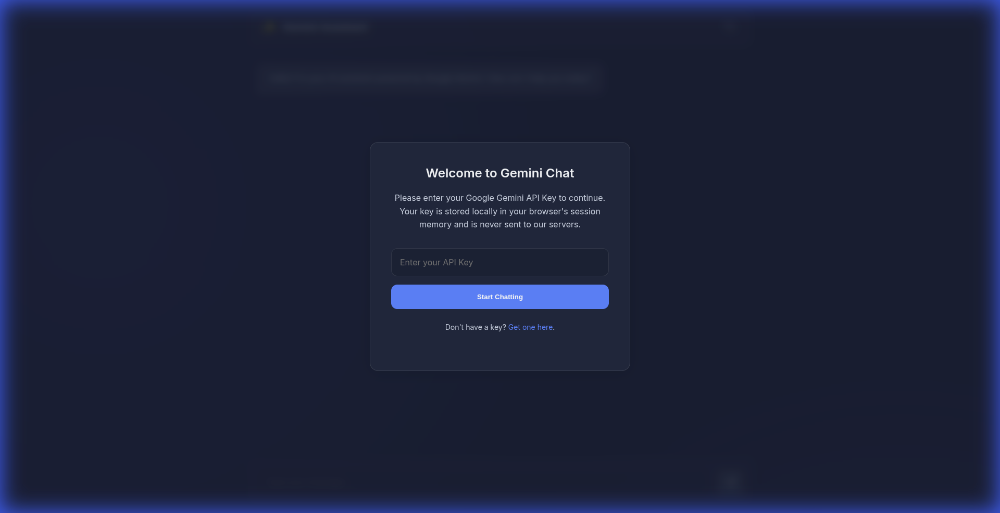

# 🤖 Gemini AI Chatbot Assistant

A modern, elegant AI chatbot powered by Google's Gemini API, featuring real-time streaming responses and a beautiful glassmorphism UI design.



## 🌐 Live Demo

**[Try it now →](https://macgenious.github.io/ai-chatbot-assistant/)**

## ✨ Features

- **🔐 Client-Side Security**: Your API key is stored only in your browser's `sessionStorage` and never sent to any server
- **⚡ Real-Time Streaming**: Responses are decoded and rendered chunk-by-chunk for an immediate, conversational feel using Gemini's `streamGenerateContent` endpoint
- **🎨 Modern UI/UX**: Built with vanilla CSS featuring:
  - Glassmorphism design principles
  - Responsive flexbox layouts
  - Hardware-accelerated animations
  - Beautiful gradient backgrounds
  - Smooth scrolling and transitions
- **📝 Markdown Support**: AI responses support full markdown rendering with code syntax highlighting
- **♿ Accessibility**: Fully keyboard-navigable with ARIA labels
- **📱 Responsive Design**: Works seamlessly on desktop, tablet, and mobile devices

## 🛠️ Technology Stack

- **Frontend**: Pure HTML5, CSS3, and Vanilla JavaScript (no frameworks)
- **AI Model**: Google Gemini API
- **Styling**: Custom CSS with glassmorphism effects
- **Markdown Parsing**: [Marked.js](https://marked.js.org/)
- **Typography**: Inter font from Google Fonts

## 🚀 Getting Started

### Prerequisites

- A modern web browser (Chrome, Firefox, Safari, Edge)
- A Google Gemini API key ([Get one here](https://aistudio.google.com/app/apikey))

### Local Development

1. **Clone the repository**
   ```bash
   git clone https://github.com/macgenious/ai-chatbot-assistant.git
   cd ai-chatbot-assistant
   ```

2. **Start a local server**
   
   Using Python:
   ```bash
   python3 -m http.server 8000
   ```
   
   Or using Node.js:
   ```bash
   npx -y http-server -p 8000
   ```

3. **Open your browser**
   
   Navigate to `http://localhost:8000`

4. **Enter your API key**
   
   When prompted, enter your Google Gemini API key. It will be stored in your browser's session storage.

> **⚠️ Important**: Do not open the `index.html` file directly in your browser using the `file:///` protocol, as this will cause CORS errors and prevent the CSS from loading. Always use a local web server.

## 📂 Project Structure

```
ai-chatbot-assistant/
├── index.html          # Main HTML structure
├── css/
│   └── style.css      # All styling (glassmorphism, animations, responsive)
├── js/
│   ├── config.js      # Gemini API configuration
│   ├── api.js         # API interaction and streaming logic
│   └── script.js      # UI logic and event handlers
├── .nojekyll          # Ensures GitHub Pages serves files correctly
└── README.md          # This file
```

## 🏗️ Architecture

### API Key Management
The application follows a "Bring Your Own Key" (BYOK) architecture:
- API keys are stored in `sessionStorage` (cleared when tab closes)
- No server-side storage or transmission
- Users maintain full control of their credentials

### Streaming Implementation
```javascript
// Simplified streaming flow
const stream = await fetch(GEMINI_STREAM_ENDPOINT, {
  method: 'POST',
  body: JSON.stringify({ contents: messages })
});

for await (const chunk of readStream(stream)) {
  const text = parseChunk(chunk);
  appendToMessage(text);  // Real-time rendering
}
```

### UI Components
- **Modal System**: API key entry with validation
- **Chat Interface**: Message history with user/AI distinction
- **Input Area**: Auto-resizing textarea with send button
- **Info Section**: Lazy-loaded technical details

## 🎨 Design Philosophy

The UI embraces **glassmorphism**, a modern design trend featuring:
- Semi-transparent backgrounds with blur effects
- Subtle borders and shadows
- Gradient accents
- Smooth, fluid animations

Color palette:
- Background: Deep navy (`#0f172a`)
- Accent: Vibrant blue (`#3b82f6`)
- Glass panels: Semi-transparent slate with backdrop blur
- Text: High-contrast white for readability

## 🔒 Security Considerations

- **API Key Storage**: Keys are stored in `sessionStorage`, not `localStorage`, ensuring they're cleared when the browser tab is closed
- **No Server Backend**: All API calls are made directly from the client to Google's servers
- **HTTPS on GitHub Pages**: Deployed site uses HTTPS for secure transmission
- **No Data Collection**: This application does not collect, store, or transmit any user data

## 🤝 Contributing

Contributions are welcome! Feel free to:
- Report bugs
- Suggest new features
- Submit pull requests

## 📄 License

This project is open source and available under the [MIT License](LICENSE).

## 🙏 Acknowledgments

- [Google Gemini](https://ai.google.dev/) for the powerful AI API
- [Marked.js](https://marked.js.org/) for markdown parsing
- [Google Fonts](https://fonts.google.com/) for the Inter typeface

## 📧 Contact

Created by [@macgenious](https://github.com/macgenious)

---

**[🚀 Launch Live Demo](https://macgenious.github.io/ai-chatbot-assistant/)**
